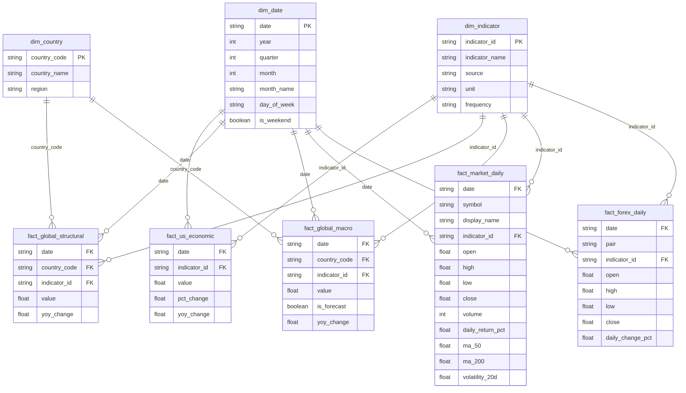

# Macro Dashboard

ETL pipeline that pulls global macroeconomic data from four free APIs, transforms it into a star schema, and loads it into Power BI via a Python script data source.

**Data sources:** FRED · World Bank · IMF DataMapper · Yahoo Finance — no API keys required.

---

## Data coverage

| Source | Frequency | Coverage |
|---|---|---|
| FRED | Monthly / Quarterly | CPI, Fed Funds Rate, Real GDP, 10Y Treasury Yield, Unemployment Rate, Trade Balance |
| World Bank | Annual | GDP, population, GNI per capita, unemployment, GDP growth, inflation, debt-to-GDP, current account, government revenue — G20 nations |
| IMF WEO | Annual | GDP growth, inflation, debt-to-GDP, current account, government revenue — G20 nations; includes ~5-year forecasts (`is_forecast`) |
| Yahoo Finance | Daily | S&P 500, NASDAQ 100, FTSE 100, DAX, Nikkei 225 (OHLCV + MAs + volatility); EUR/USD, GBP/USD, USD/JPY |

---

## Setup

```bash
python -m venv venv
source venv/bin/activate      # Windows: venv\Scripts\activate
pip install -r requirements.txt
```

**Run the pipeline:**

```bash
python main.py
# or
./refresh.sh      # Mac/Linux
refresh.bat       # Windows
```

Output: `output/*.csv` (8 files) + `output/dashboard.db` (SQLite).

---

## Project structure

```
Macro-Dashboard/
├── main.py              # ETL orchestrator
├── config.py            # series IDs, country lists, date ranges, rate limits
├── powerbi_loader.py    # Power BI Python data source bridge
├── refresh.sh           # one-command refresh (Mac/Linux)
├── refresh.bat          # one-command refresh (Windows)
├── requirements.txt
│
├── pipeline/
│   ├── extract.py       # one function per API source
│   ├── transform.py     # raw data → star schema DataFrames
│   ├── validate.py      # data quality checks (7 assertions)
│   └── load.py          # CSV + SQLite export
│
└── output/              # gitignored, generated on each run
    ├── dashboard.db
    ├── *.csv
    ├── pipeline.log
    └── raw/             # raw JSON from each API (debug)
```

---

## Pipeline

```
FRED
World Bank   →  extract.py  →  transform.py  →  validate.py  →  load.py
IMF                                                                  │
Yahoo Finance                                               ┌────────┴────────┐
                                                       output/*.csv    dashboard.db
                                                                             │
                                                                   powerbi_loader.py
                                                                             │
                                                                    Power BI Desktop
```

Phases run sequentially. All output is logged to console and `output/pipeline.log`.

---

## Schema

3 dimension tables + 5 fact tables (star schema). All fact tables join to `dim_date`. Country-level facts join to `dim_country`. All tables with an `indicator_id` join to `dim_indicator`.



---

## Indicator ID prefixes

All indicators share a single `dim_indicator` table. IDs are prefixed by source to prevent collisions.

| Prefix | Source | Example |
|---|---|---|
| `FRED_` | FRED | `FRED_CPIAUCSL` |
| `WB_` | World Bank | `WB_NY.GDP.MKTP.CD` |
| `IMF_` | IMF DataMapper | `IMF_NGDP_RPCH` |
| `YF_` | Yahoo Finance | `YF_^GSPC`, `YF_EURUSD=X` |

---

## Power BI

`powerbi_loader.py` is the data source Power BI calls on every Refresh. It operates in two modes set via the `POWERBI_FRESH` environment variable:

| `POWERBI_FRESH` | Behavior | Duration |
|---|---|---|
| `0` (default) | Reads `output/dashboard.db` from last pipeline run | ~1 s |
| `1` | Runs full extract + transform live against all APIs | ~1–3 min |

**Typical refresh cycle:**
1. `./refresh.sh` (or `refresh.bat`) — updates `dashboard.db`
2. Power BI Desktop → **Home → Refresh** — reads the updated cache

---

## Configuration

All tunables are in `config.py`. No environment variables needed to run the pipeline.

Notable defaults:
- `START_DATE = "2015-01-01"` — change and re-run to extend history
- `dim_date` extends 6 years past `END_DATE` to accommodate IMF forecast rows that land in future years
- Rate series (`FEDFUNDS`, `GS10`, `UNRATE`) compute YoY as an absolute point difference, not a percentage change
- IMF requests have a 2s sleep between calls — the API rate-limits aggressively

---

## Known limitations

- **World Bank** data typically lags 1–2 years; recent years may be incomplete or missing entirely
- **IMF `rev`** (government revenue) has sparse coverage for several countries
- **yfinance** may return gaps for non-US indices around market holidays; empty responses are skipped
- **FRED** is accessed via an undocumented public CSV endpoint — if it breaks, the fallback is the official JSON API at `api.stlouisfed.org/fred/series/observations` (requires a free API key)
- `ma_50` / `ma_200` are `NaN` for the first 50/200 trading days per symbol by design
